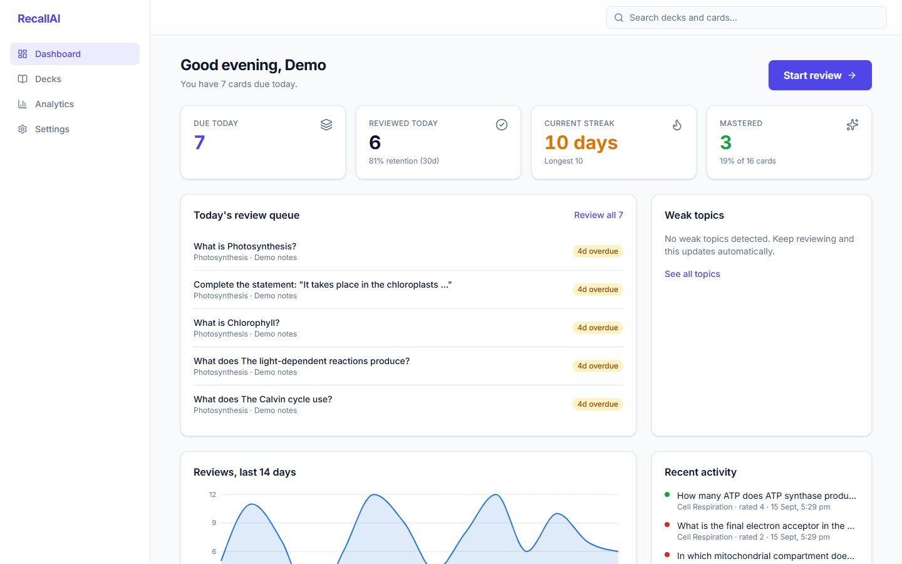
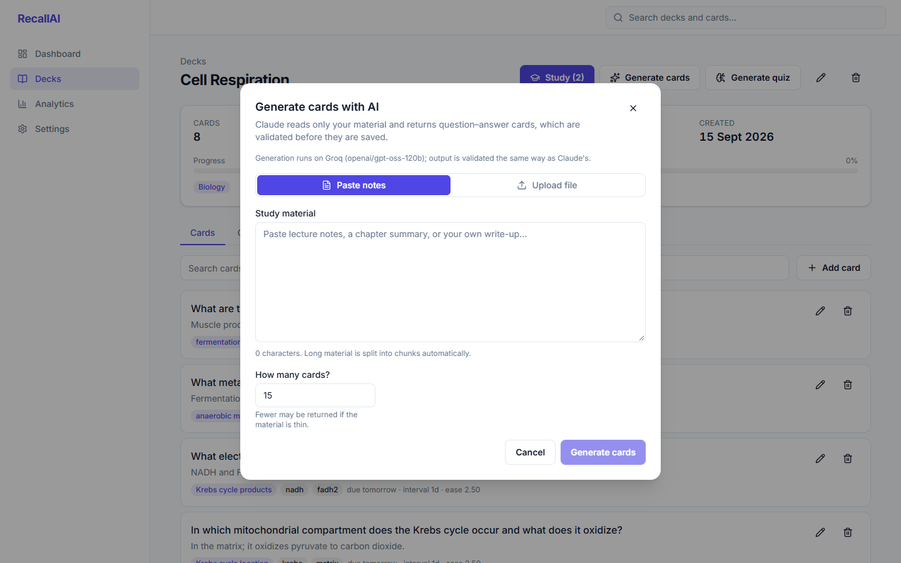
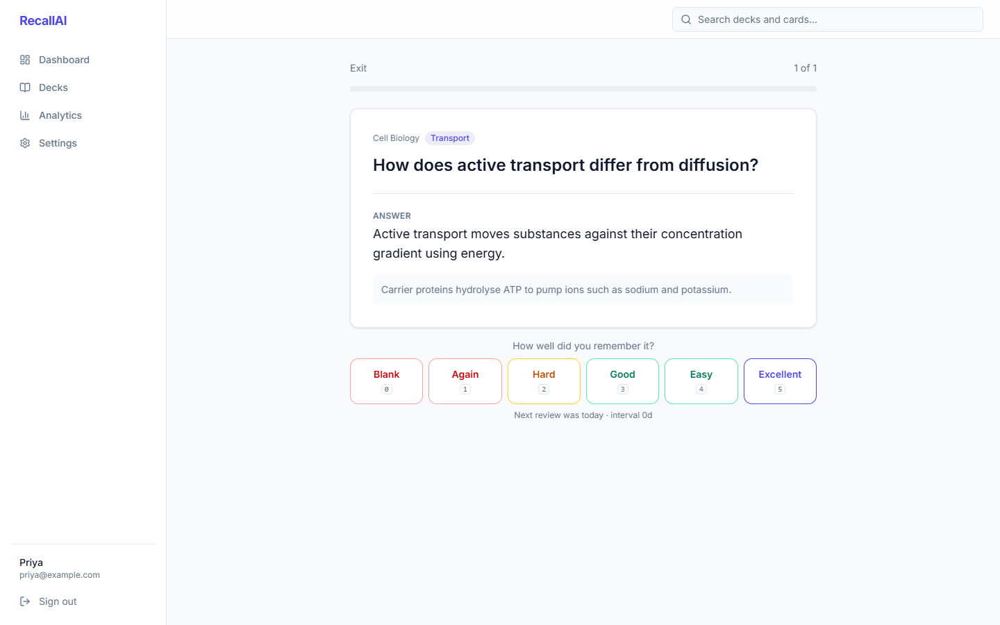
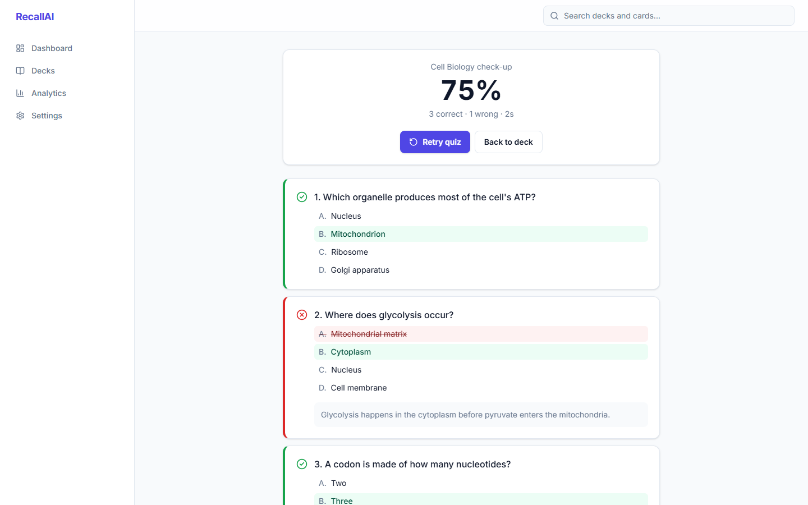
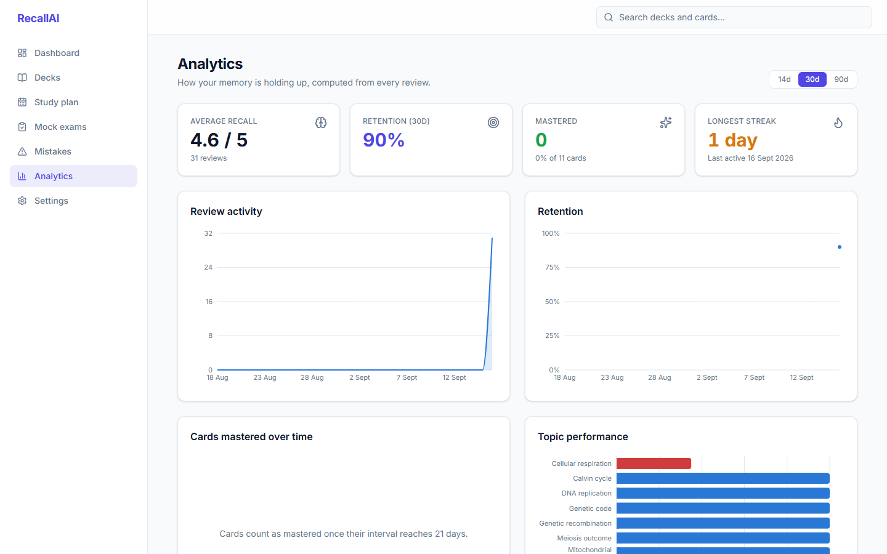

# RecallAI

## Table of contents

1. [Project overview](#project-overview)
2. [Problem statement](#problem-statement)
3. [Features](#features)
4. [Architecture](#architecture)
5. [Technology stack](#technology-stack)
6. [Database schema](#database-schema)
7. [SM-2 spaced repetition](#sm-2-spaced-repetition)
8. [Review system](#review-system)
9. [AI architecture](#ai-architecture) (prompt engineering, structured output, failure handling, caching, chunking, cost, hallucination)
10. [Quizzes](#quizzes)
11. [Weak topics and analytics](#weak-topics-and-analytics)
12. [Frontend](#frontend)
13. [Security](#security-and-authentication) (rate limiting, logging, production configuration, error format)
14. [API documentation](#api)
15. [Local setup](#local-setup-without-docker)
16. [Docker setup](#docker-setup)
17. [Environment variables](#environment-variables)
18. [Testing](#testing)
19. [Continuous integration](#continuous-integration)
20. [AWS deployment](#aws-deployment)
21. [Screenshots](#screenshots)
22. [Future improvements](#future-improvements)
23. [Interview talking points](#interview-talking-points)
24. [Development history](#development-history)

## Project overview

An AI-powered study companion. Paste notes or upload a PDF, let Claude turn them into flashcards and quizzes, then review with the SM-2 spaced-repetition algorithm so you only study what is actually due.

> **Status:** All twelve phases complete: full backend feature set, Next.js frontend, production hardening, CI and an AWS deployment guide.

### Why this is more than an AI wrapper

Claude does exactly two things here: generate flashcards and generate quizzes from user-supplied material. Everything else is deterministic software:

| Concern | Handled by |
|---|---|
| Flashcard / quiz generation, explanations | Claude, behind strict JSON validation, retries and a content-hash cache |
| Review scheduling (SM-2), streaks, scoring, weak-topic detection | Plain Java services with unit tests |
| Authentication, authorization, rate limiting, search | Spring Security, JPA, PostgreSQL |

The model never sees credentials, never decides what is due, and its output is never trusted without validation.

## Problem statement

Students collect notes faster than they can learn them. Re-reading feels productive but decays quickly; writing good flashcards by hand takes longer than the studying itself; and without a schedule, revision is either everything at once before an exam or nothing at all.

Two things are known to work and are rarely combined well:

- **Active recall**: answering a question from memory beats re-reading.
- **Spaced repetition**: reviewing just before you would forget makes each review count, and the SM-2 algorithm has scheduled that for decades.

RecallAI removes the two frictions. A language model writes the questions from the student's own material, and a deterministic scheduler decides when each one comes back. The student's job shrinks to grading their own recall a few times a day.

## Features

- Register and log in; every deck, card, review and quiz is private to its owner.
- Create decks with subject, description and tags; search and filter them.
- Paste notes or upload `.txt` / `.pdf` study material; large documents are chunked automatically.
- Generate flashcards with Claude, validated against a strict schema before anything is saved.
- Review one card at a time, reveal the answer and explanation, rate recall 0–5 with keyboard shortcuts.
- SM-2 scheduling per card; a daily queue that contains only cards that are actually due, overdue and weakest first.
- Generate multiple-choice quizzes from a deck or from notes; take them one question at a time; get explanations for misses; retry.
- Weak-topic detection from review history, with configurable thresholds and no model involved.
- Dashboard with due, reviewed, streak and mastered tiles; analytics with activity, retention, mastery and topic charts.
- Study streaks computed from real calendar days.
- Full-text search across decks and cards in PostgreSQL.
- Content-hash caching of AI responses, corrective retries on invalid output, per-user rate limiting on AI endpoints.
- Consistent JSON errors, request correlation ids, structured logging, OpenAPI docs, Docker images, CI.

## Architecture

```
                     ┌──────────────────────────┐
   browser  ───────▶ │  Next.js 16 (frontend)    │   proxy.ts: token → redirects
                     │  client-rendered pages    │   lib/api.ts: bearer token, error mapping
                     └────────────┬─────────────┘
                                  │ HTTPS  /api/**  (JSON, Authorization: Bearer <JWT>)
                                  ▼
   ┌──────────────────────────────────────────────────────────────────┐
   │  Spring Boot 3.5 (backend)                                       │
   │  RequestLoggingFilter → JwtAuthenticationFilter → RateLimit(/ai) │
   │                                                                  │
   │  Controllers (thin)  →  Services (business rules)  →  JPA repos  │
   │       │                    │            │                        │
   │       │            Sm2Service      AiGenerationService           │
   │       │            (pure)          cache → prompt → retry →      │
   │       │                            validate → persist            │
   └───────┼────────────────────┼────────────────┼────────────────────┘
           │                    │                │
           ▼                    ▼                ▼
      OpenAPI/Swagger      PostgreSQL 16     Claude API (official Java SDK)
                           Flyway schema     structured JSON output
```

Request flow for the two kinds of work:

```
Review a card:   ReviewController → ReviewService → Sm2Service → CardRepository + ReviewHistoryRepository
Generate cards:  AiController → FlashcardGenerationService → StudyMaterialExtractor → TextChunker
                 → AiGenerationService → AiCacheService | PromptService → AiRetryService → ClaudeClient
                 → AiResponseValidator → CardService.createAll (one transaction)
```

Design rules that hold everywhere:

- Controllers carry no business logic; they validate input, resolve the authenticated user and call one service.
- Entities never leave the service layer; every response is a DTO record.
- The SM-2 scheduler and the weak-topic rule are pure code with no framework or model dependency.
- The model is reached through one interface (`ClaudeClient`) so tests substitute a scripted fake.
- Every query is scoped by the authenticated user id; foreign resources are 404.

### Repository layout

```
recall-ai/
├── backend/                 Spring Boot API
│   ├── src/main/java/com/recallai/
│   │   ├── ai/              Claude client, prompts, validation, retry, cache
│   │   ├── config/          Security, CORS, OpenAPI, properties
│   │   ├── controller/      REST controllers (thin; no business logic)
│   │   ├── dto/             Request/response records
│   │   ├── entity/          JPA entities
│   │   ├── exception/       Centralized error handling
│   │   ├── repository/      Spring Data repositories
│   │   ├── scheduler/       SM-2 algorithm
│   │   ├── security/        JWT
│   │   └── service/         Business logic
│   ├── src/main/resources/db/migration/   Flyway migrations
│   └── src/test/            Unit and integration tests
├── frontend/                Next.js application
│   ├── app/                 Routes
│   ├── components/          Reusable UI
│   ├── hooks/               React hooks
│   ├── lib/                 API client, utilities
│   └── types/               Shared TypeScript types
├── docker-compose.yml
└── .env.example
```

## Technology stack

- **Backend:** Java 21, Spring Boot 3.5, Spring Web, Spring Data JPA, Spring Security, Bean Validation, Flyway, PostgreSQL 16, springdoc-openapi, JUnit 5, Mockito, Testcontainers
- **Frontend:** Next.js 16 (App Router), TypeScript, Tailwind CSS 4
- **Infrastructure:** Docker, docker-compose, environment-variable configuration

## Database schema

Flyway owns the schema (`backend/src/main/resources/db/migration`). Hibernate runs in `validate` mode and never alters tables.

| Table | Purpose |
|---|---|
| `users` | Accounts; bcrypt password hash |
| `decks` | User-owned collections of cards with subject and tags |
| `cards` | Question/answer/explanation plus SM-2 state: `ease_factor`, `interval`, `repetitions`, `due_date` |
| `review_history` | One row per review with before/after scheduling values, used for analytics, streaks and weak topics |
| `quizzes`, `quiz_questions` | AI-generated multiple-choice quizzes |
| `quiz_attempts` | Scores and duration per attempt |
| `quiz_attempt_answers` | Selected answer and correctness per question per attempt |
| `ai_cache` | Validated Claude responses keyed by `(content_hash, operation_type, model, prompt_version)` |

Check constraints enforce SM-2 invariants at the database level (ease factor ≥ 1.30, non-negative interval and repetitions, quality score 0–5, correct answer index 0–3).

## SM-2 spaced repetition

Scheduling is deterministic Java in `backend/src/main/java/com/recallai/scheduler` (`Sm2Service`, `Sm2State`, `ReviewResult`). It has no dependency on Spring Web, JPA or Claude, and is exercised by 30+ unit tests before any review endpoint exists.

**What the algorithm tracks per card**

| Field | Meaning | Start |
|---|---|---|
| `easeFactor` | How easy the card is; multiplies the interval on each success | 2.50 |
| `interval` | Days between the last successful review and the next one | 0 |
| `repetitions` | Consecutive successful reviews since the last failure | 0 |
| `dueDate` | Day the card re-enters the review queue | creation day |

**What happens on a review** (quality `q` from 0 = blank to 5 = perfect):

1. `q < 3` is a lapse. Repetitions reset to 0 and the card is scheduled for relearning tomorrow (interval 1). The ease factor is left unchanged, as in Wozniak's original description.
2. `q ≥ 3` is a success. The next interval is 1 day for the first repetition, 6 days for the second, and `round(previousInterval × easeFactor)` afterwards, always at least one day longer than before. The multiplication uses the ease factor *before* this review's adjustment.
3. On success the ease factor moves by `0.1 − (5 − q) × (0.08 + (5 − q) × 0.02)` and is floored at 1.30. So quality 5 adds 0.10, quality 4 leaves it unchanged, quality 3 subtracts 0.14. There is no upper bound.
4. `dueDate = today + newInterval`.

With steady quality-4 recalls a card follows the classic ladder 1 → 6 → 15 → 38 → 95 → 238 days. Repeated quality-3 recalls push the ease down to the 1.30 floor, so hard cards come back more often; quality-5 recalls raise it, so easy cards come back less often.

**Why not let the AI schedule?** Spacing is a well-studied, deterministic problem with a known-good algorithm. A model would be slower, non-reproducible, cost money per review and be impossible to unit test. Claude is used only where language understanding is the job: turning study material into cards and quizzes.

## Review system

`ReviewService` is the only code that changes a card's schedule, and it never does arithmetic itself:

```
ReviewController → ReviewService → Sm2Service (pure) → ReviewHistoryRepository
```

- **Queue** (`GET /api/reviews/due`): returns only cards with `due_date <= today`, ordered most-overdue first, then lowest ease factor (weakest) first. Future cards are never included. The response carries `totalDue` even when a `limit` truncates the list, and each card reports `daysOverdue`.
- **Grading** (`POST /api/reviews/{cardId}` with `{"quality": 0..5}`): in one transaction the card row is locked (`SELECT … FOR UPDATE`) so concurrent gradings cannot race, SM-2 computes the next schedule, the card is updated, and a `review_history` row records the before/after interval and ease. The response includes the new schedule, whether the card is now mastered, and how many cards remain due today.
- **Mastered**: a card is mastered when its interval reaches `MASTERED_INTERVAL_DAYS` (default 21, Anki's "mature" threshold). Deck statistics count mastered cards with the same rule.
- **Streaks** (`GET /api/reviews/streak`): computed from the distinct UTC days on which the user reviewed anything. `StreakCalculator` walks actual calendar dates, so a gap breaks the run and a streak that ended yesterday still counts as current (the user can extend it today). Longest streak is tracked independently of the current one.
- **History** (`GET /api/reviews/history`): paginated, newest first, with the card question and deck name for the activity feed.

Days are currently computed in UTC; per-user time zones are a listed future improvement.

## AI architecture

All model access lives in `backend/src/main/java/com/recallai/ai` and is reached through one facade, `AiGenerationService`. Nothing else in the application talks to Claude, builds a prompt, or parses model output.

```
AiGenerationService
  ├─ AiCacheService        content-hash lookup / store (PostgreSQL ai_cache)
  ├─ PromptService         FlashcardPromptBuilder, QuizPromptBuilder, corrective prompts
  ├─ AiRetryService        call → validate → corrective re-ask → transport retry → controlled error
  │    └─ ClaudeClient     interface; AnthropicClaudeClient (official Java SDK) in production,
  │                        FakeClaudeClient (scripted) in tests
  └─ AiResponseValidator   strict parsing and content rules → GeneratedFlashcard / GeneratedQuizQuestion
```

**Why Claude, and only here.** Turning free-form notes into good questions and plausible distractors is a language task. Everything else in RecallAI is deterministic code, because a model is slower, non-reproducible, costs money per call and cannot be unit-tested the way `Sm2Service` can.

### Structured prompt engineering

Prompts are versioned templates, not strings scattered through services. `FlashcardPromptBuilder.VERSION` and `QuizPromptBuilder.VERSION` (currently `v1`) are part of every cache key, so changing a prompt automatically stops serving responses generated by the old one.

Each prompt has three parts:

1. **System prompt**: the role and the rules. Use only the supplied material and never invent facts; return fewer items rather than pad; one fact per card; concise questions, precise answers, an explanation drawn from the material, a short topic label and lowercase tags; no duplicates; no cards about the document itself; respond with JSON only.
2. **User message**: the requested count and the material wrapped in `<study_material>` tags so instructions and content cannot be confused.
3. **Output schema**: a JSON Schema sent as the API's structured-output constraint (`output_config.format`). For quizzes it pins exactly four options and `correctAnswer` in 0–3.

The response shapes are:

```json
{ "cards": [ { "question": "...", "answer": "...", "explanation": "...", "topic": "...", "tags": ["..."] } ] }
{ "questions": [ { "question": "...", "options": ["...", "...", "...", "..."], "correctAnswer": 0, "explanation": "..." } ] }
```

### Guaranteeing structured output

Two independent layers. The API is asked for schema-constrained JSON, and the backend still validates everything as if it were not. `AiResponseValidator` checks that the text parses as a JSON object (a ```json fence is tolerated, prose around JSON is not), that the array exists and is non-empty (extra items beyond the requested count are dropped rather than triggering a paid retry), and per item that every required field is present, of the right type, non-blank and within length limits; quiz options must be four distinct non-empty strings and the answer index in range. Tags are normalized exactly like user-entered tags. Duplicate questions are dropped. Any problem is reported with its path (`cards[2].answer is missing`), and only validated `GeneratedFlashcard` / `GeneratedQuizQuestion` records leave the package.

### AI failure handling

`AiRetryService` implements the strategy:

1. Call the model.
2. Validate.
3. If invalid, send a corrective follow-up: the conversation is extended with the rejected reply as an assistant turn and a user turn that lists each problem and restates the format requirement. This runs `AI_VALIDATION_RETRIES` times (default 1).
4. If the call itself fails transiently (rate limit, 5xx, network), wait and retry `AI_TRANSPORT_RETRIES` times on top of the SDK's own retries. Non-retryable failures (bad key, refusal) are not retried.
5. Otherwise return a controlled error: `AI_INVALID_RESPONSE` (502) or `AI_ERROR` (502) in the standard error shape. Truncated output (`stop_reason = max_tokens`) is treated as invalid.

Invalid output is never persisted and never cached. Tests simulate malformed JSON, prose, missing fields, wrong types, empty arrays, bad option counts, out-of-range answers and truncation, plus the retry paths, using `FakeClaudeClient`.

### Content-hash caching

Before calling the model, `AiCacheService` computes `SHA-256(normalize(material) + params)` where normalization applies Unicode NFC, lower-casing and whitespace collapsing, and `params` carries the requested count. The cache key is `(hash, operation, model, prompt version)`; a hit returns the validated items without a call, a miss stores them only after validation. Rows are content-addressed rather than user-addressed, so two students pasting the same chapter share one model call, and no user-specific data is ever cached. Concurrent inserts of the same key are tolerated.

### Study material input and chunking

Students paste notes (`POST /api/ai/flashcards`) or upload a `.txt` or `.pdf` (`POST /api/ai/flashcards/upload`, multipart). `StudyMaterialExtractor` validates the upload before anything else happens: non-empty, a supported type (checked by extension, content type and, for PDFs, the `%PDF` signature), parseable, not encrypted, and containing extractable text (scanned PDFs are rejected with a clear message). Text is extracted with Apache PDFBox, control characters are stripped, whitespace is normalized and the result is capped at `MATERIAL_MAX_CHARS`. Uploads are also capped at `MAX_UPLOAD_SIZE` by the servlet container.

Large documents are never sent to the model in one request. `TextChunker` splits the material into pieces of at most `AI_MAX_INPUT_CHARS`, preferring paragraph boundaries, then sentence boundaries, and only then a cut at the nearest whitespace; no text is lost. A request may span at most `MATERIAL_MAX_CHUNKS` pieces, which bounds the cost of one click. The requested card count is shared across chunks in proportion to their length, each chunk is generated (and cached) independently, results are merged with cross-chunk de-duplication, and the cards are saved to the deck in a single transaction. Model calls run outside any database transaction. If a chunk fails after retries nothing is saved, but the chunks that succeeded are already cached, so retrying only pays for the failed piece.

### Cost controls

- Cache first; identical material never pays twice.
- Input is capped at `AI_MAX_INPUT_CHARS` per request (larger documents are chunked by the caller), output at `CLAUDE_MAX_TOKENS`, item counts at `AI_MAX_CARDS` / `AI_MAX_QUIZ_QUESTIONS`.
- `CLAUDE_EFFORT` (default `medium`) tunes reasoning depth for what is a well-bounded extraction task.
- Every call logs latency, input and output tokens, cache hit or miss and retry count. Study content and keys are never logged.
- Per-user rate limiting of the generation endpoints (`AI_RATE_LIMIT`); see [Rate limiting](#rate-limiting).

### Demo mode (no API key)

Set `AI_DEMO_MODE=true` and the backend swaps `AnthropicClaudeClient` for `DemoClaudeClient`, which builds cards and quiz questions from the pasted notes with simple sentence heuristics: no network, no key, no cost. It exists so the whole flow (upload, chunking, validation, caching, persistence, rate limiting, the study session) can be demonstrated on a laptop or in an interview without spending anything. It is **not AI**: every card is tagged `demo`, its explanation says so, the model recorded in the cache is `demo` so demo output never mixes with real output, the generate dialogs show an amber "Demo mode is on" notice (driven by `GET /api/ai/status`), and the README says so here. Turn it off and set `CLAUDE_API_KEY` for real generation.

### Handling hallucination

The prompt restricts the model to the supplied material and tells it to produce fewer items rather than invent, the material is delimited so it cannot be read as instructions, and every generated card is shown to the user before study. The application does not claim to detect factual errors; it minimizes their likelihood and keeps the human in the loop.

## Quizzes

`POST /api/ai/quiz` builds a multiple-choice quiz for a deck. Without `text` the material is the deck's own cards (question, answer, explanation), so the quiz tests what the student is actually learning; with `text` it uses the supplied notes. Generation goes through the same chunked, cached and validated pipeline as flashcards, and the quiz is stored only when every chunk has produced valid questions. Each stored question has exactly four options, a correct index in 0–3 and an explanation, enforced by the validator, the entity constructor and database check constraints.

Two response shapes keep the quiz honest:

- `GET /api/quizzes/{id}` returns questions and options only. The correct answer and explanation are withheld while the quiz is being taken.
- `POST /api/quizzes/{id}/attempts` grades the submission with `QuizScorer` (pure, deterministic: skipped questions are wrong, unknown or duplicate question ids are rejected) and returns score, percentage, correct and incorrect counts, completion time, optional client-measured duration, and for every question the selected answer, the correct answer and the explanation. Each attempt and its per-question results are stored, so `GET /api/quizzes/{id}/attempts/{attemptId}` can replay a past result and the quiz list reports attempt counts and best scores.

## Weak topics and analytics

Everything under `/api/analytics` is computed by SQL aggregates over `review_history`, `cards` and `quiz_attempts`; Java only fills calendar gaps and applies the weak-topic rule. No model is involved.

**Weak-topic detection** (`GET /api/analytics/weak-topics`, `GET /api/analytics/topics`): one query groups reviews by card topic (case-insensitively) and computes review count, all-time average quality, success rate, and the average quality of the topic's most recent `WEAK_TOPIC_RECENT_WINDOW` reviews (a window function). `WeakTopicDetector` then flags a topic as weak when it has at least `WEAK_TOPIC_MIN_REVIEWS` reviews and that recent average is below `WEAK_TOPIC_QUALITY_THRESHOLD` (default 3.0, the SM-2 passing grade). Using the recent window means a topic the student has since improved on is no longer flagged, while a topic with too little history is never flagged on a single bad day. Both endpoints accept `deckId`.

**Dashboard summary** (`GET /api/analytics/summary`): cards due today, reviewed today, total cards, cards mastered (interval at or above `MASTERED_INTERVAL_DAYS`) with a percentage, total decks, total reviews, average recall (mean quality 0–5), 30-day retention rate (share of successful reviews), current and longest streak, last active day, quizzes taken and average quiz score.

**Charts**: `GET /api/analytics/activity?days=30` returns one point per calendar day (gaps filled with zeros) with reviews, successful reviews, average quality and retention percent; `GET /api/analytics/mastery?days=90` returns the cumulative number of cards that had reached the mastered interval by each day, based on the first review that took each card there.

## Frontend

A Next.js 16 App Router application in `frontend/`, written as a client-rendered SPA over the REST API (the backend is the only place that talks to Claude or the database).

| Route | What it does |
|---|---|
| `/login`, `/register` | Auth forms with field-level errors from the API; on success the JWT is stored in a same-site cookie |
| `/dashboard` | Time-of-day greeting, Due / Reviewed / Streak / Mastered tiles, "Start review" CTA, today's queue, weak topics, 14-day activity chart, recent activity |
| `/decks` | Searchable, tag-filtered, paginated deck grid with progress bars; create deck modal |
| `/decks/[id]` | Deck header with counts and progress; Study, Generate cards (paste or drag-and-drop TXT/PDF), Generate quiz, Edit, Delete; tabs for cards (search, add, edit, delete) and quizzes |
| `/study/[deckId]` (`all` for every deck) | One card at a time: question, reveal, answer and explanation, six SM-2 rating buttons, progress bar, cards remaining, session summary |
| `/quiz/[quizId]` | One question at a time with four options, then a scored results screen with correct/incorrect markers and explanations for misses, retry |
| `/analytics` | Recall, retention, mastered and streak tiles; review activity, retention, mastery-over-time and topic-performance charts (Recharts); full topic table with weak flags |
| `/settings` | Account details, keyboard shortcut reference, how scheduling works, sign out |

**Keyboard shortcuts** in the study session: `Space` or `Enter` reveals the answer, `0`–`5` rate the card (`1` Again, `2` Hard, `3` Good, `4` Easy, `5` Excellent, `0` Blank). In quizzes `1`–`4` pick an option and `Enter` continues.

**How it is built**

- `proxy.ts` (Next 16's middleware) redirects visitors without a token away from protected routes and logged-in users away from the auth pages, server-side, so there is no flash of the wrong page. The API remains the authority on every token.
- `lib/api.ts` is a single fetch wrapper that attaches the bearer token, parses the backend's error shape into `ApiRequestError` (status, code, field errors), and signs the user out on 401. `lib/endpoints.ts` has one typed function per endpoint, so pages never build URLs.
- `hooks/useApiQuery` is a small fetch-on-mount hook with abort-on-unmount, derived loading state and refetch, which keeps the app free of a data-fetching library.
- Reusable UI in `components/ui` (buttons, fields, modal with focus management and Escape, tag input, stat tiles, progress bar, empty/error/loading states, toasts). Every list has loading skeletons, an error state with retry and an empty state.
- Tailwind 4 theme tokens with a dark-mode palette; chart colours follow a validated categorical palette with a reserved status colour for weak topics.
- Responsive from phone widths up: the sidebar collapses to a menu, header actions wrap under the title, rating buttons reflow to two rows.

**Tests**: Vitest with Testing Library covers the API client (auth header, error mapping, 401 handling, network failures, 204s), the format helpers and the rating bar. Run `npm test`.

## Security and authentication

- **Registration and login** issue a signed JWT (HS256) containing only the user id and email. Tokens expire after `JWT_EXPIRATION_MINUTES`.
- **Passwords** are hashed with BCrypt and never logged or returned. Login for an unknown email still runs a BCrypt comparison against a dummy hash so response timing does not reveal whether an account exists.
- **Every request** passes through `JwtAuthenticationFilter`, which verifies the signature and expiry, then reloads the user from PostgreSQL. A token for a deleted account is rejected.
- **Stateless**: no sessions, no cookies on the API, CSRF disabled because the API only accepts bearer tokens from a separate origin. CORS is restricted to `CORS_ALLOWED_ORIGINS`, to the `Authorization`, `Content-Type` and `X-Request-Id` headers, and exposes only the correlation and rate-limit headers.
- **User isolation**: services always scope queries by the authenticated user id taken from the security context, never from the request body. Foreign resources answer 404, never 403.
- **Fail-fast configuration**: the application refuses to start if `JWT_SECRET` is missing or shorter than 32 characters. No secret has a default; `.env*` files are git-ignored.
- **Input validation** on every body and query parameter (Bean Validation), file uploads checked by type, signature, size and extractability, tags and emails normalized, all persistence through JPA parameters (no string-built SQL).
- **Security headers** from Spring Security's defaults (`X-Content-Type-Options`, `X-Frame-Options: DENY`, no-store cache control); the actuator exposes only `health` and `info`; Swagger can be switched off with `SWAGGER_ENABLED=false`.
- **Frontend token storage**: the JWT is kept in a `SameSite=Lax` cookie (marked `Secure` on HTTPS) so the Next.js proxy can redirect server-side. It is readable by page JavaScript, the same exposure as local storage; moving to an HttpOnly cookie through a backend-for-frontend route is listed under future improvements.

### Rate limiting

`POST /api/ai/flashcards`, `POST /api/ai/flashcards/upload` and `POST /api/ai/quiz` are limited per user to `AI_RATE_LIMIT` requests per rolling hour (default 20). `RateLimitService` keeps a fixed window per user in memory (the app runs as one instance; the limit bounds AI spend rather than enforcing a strict quota), `RateLimitInterceptor` applies it only to `/api/ai/**` after authentication, and every AI response carries `X-RateLimit-Limit` and `X-RateLimit-Remaining`. Once spent, the API returns `429 RATE_LIMITED` with a `Retry-After` header and a message saying how long to wait. Cache hits still count as requests, which keeps the rule simple and predictable. Expired windows are swept so memory stays bounded.

### Logging and observability

`RequestLoggingFilter` gives every request a correlation id (an incoming `X-Request-Id` is honoured when it is 8–64 safe characters, otherwise a UUID is generated), echoes it on the response, and writes one access line per request with method, path, status and duration. The id and, once authenticated, the user id are in the MDC, so every log line of a request can be tied together:

```
2026-09-09T18:02:11.412+05:30  INFO [4f1c…] [user:12] c.r.ai.AiCacheService : AI cache miss for FLASHCARDS (claude-opus-5/v1)
2026-09-09T18:02:14.980+05:30  INFO [4f1c…] [user:12] c.r.ai.AnthropicClaudeClient : Claude FLASHCARDS call finished in 3560 ms: stop=end_turn in=1812 out=944
2026-09-09T18:02:15.031+05:30  INFO [4f1c…] [user:12] com.recallai.access : POST /api/ai/flashcards -> 201 (3702 ms)
```

AI calls log latency, token usage, cache hit or miss, retry count and failures. Never logged: passwords, tokens, the API key, request bodies, query strings or study content.

### What happens when Claude is unavailable

Only the two generation endpoints depend on the model. Everything else (auth, decks, cards, reviews, scheduling, quizzes already stored, analytics) keeps working. A generation request that fails after the retry policy returns `502 AI_ERROR` or `502 AI_INVALID_RESPONSE` with a plain message, nothing is persisted, and any chunk that did succeed is already cached so the retry is cheaper. Without an API key configured the server starts normally and the generation endpoints return a clear configuration error.

### Production configuration

| Setting | Behaviour |
|---|---|
| `server.shutdown=graceful` | In-flight requests (including slow AI calls) finish before the JVM stops |
| `server.compression` | Responses over 1 KB are gzip-compressed |
| `FORWARD_HEADERS_STRATEGY=framework` | Honours `X-Forwarded-*` from the load balancer so redirects and `Secure` cookies work behind TLS termination |
| `SWAGGER_ENABLED` | Hide API docs in production |
| `LOG_LEVEL` | Application log level without touching framework noise |
| Docker images | Non-root users, multi-stage builds, JRE-only runtime, health checks in compose |

### Error format

Every error, including those raised inside the security filter chain, uses one shape:

```json
{
  "timestamp": "2026-09-09T16:20:00Z",
  "status": 400,
  "error": "VALIDATION_ERROR",
  "message": "Request validation failed",
  "path": "/api/auth/register",
  "fieldErrors": { "email": "must be a well-formed email address" }
}
```

`fieldErrors` appears only for validation failures. Unexpected exceptions are logged server-side and reported as `INTERNAL_ERROR` with a generic message.

## API

Interactive documentation is served at `/swagger-ui.html` (OpenAPI JSON at `/v3/api-docs`). Click **Authorize** and paste a token to call protected endpoints.

| Method | Path | Auth | Description |
|---|---|---|---|
| POST | `/api/auth/register` | – | Create account, returns token + user |
| POST | `/api/auth/login` | – | Returns token + user |
| GET | `/api/auth/me` | Bearer | Current user |
| POST | `/api/decks` | Bearer | Create deck |
| GET | `/api/decks` | Bearer | List/search decks (`q`, `subject`, `tag`, `page`, `size`) with card, due and mastered counts |
| GET | `/api/decks/{id}` | Bearer | Deck with statistics and progress |
| PUT | `/api/decks/{id}` | Bearer | Update deck |
| DELETE | `/api/decks/{id}` | Bearer | Delete deck and its cards |
| POST | `/api/decks/{id}/cards` | Bearer | Add card |
| GET | `/api/decks/{id}/cards` | Bearer | List/search cards in a deck (`q`, `topic`, `tag`, paging) |
| GET | `/api/cards` | Bearer | Search cards across all decks |
| GET | `/api/cards/{id}` | Bearer | Get card |
| PUT | `/api/cards/{id}` | Bearer | Update card content (scheduling fields are read-only here) |
| DELETE | `/api/cards/{id}` | Bearer | Delete card |
| GET | `/api/reviews/due` | Bearer | Due queue (`deckId`, `limit`), overdue and weakest first |
| POST | `/api/reviews/{cardId}` | Bearer | Grade a card 0–5; returns the new SM-2 schedule and cards remaining |
| GET | `/api/reviews/streak` | Bearer | Current streak, longest streak, last active day, reviews today |
| GET | `/api/reviews/history` | Bearer | Paginated review history |
| POST | `/api/ai/flashcards` | Bearer | Generate cards from pasted text (`deckId`, `text`, optional `count`) |
| POST | `/api/ai/flashcards/upload` | Bearer | Generate cards from a `.txt`/`.pdf` upload (multipart `file`, `deckId`, optional `count`) |
| POST | `/api/ai/quiz` | Bearer | Generate a quiz from a deck's cards or supplied `text` (`deckId`, optional `title`, `count`) |
| GET | `/api/quizzes` | Bearer | List quizzes (`deckId`, paging) with question and attempt counts and best score |
| GET | `/api/quizzes/{id}` | Bearer | Quiz to take; answers withheld |
| DELETE | `/api/quizzes/{id}` | Bearer | Delete quiz and attempts |
| POST | `/api/quizzes/{id}/attempts` | Bearer | Submit answers; returns score and per-question results with explanations |
| GET | `/api/quizzes/{id}/attempts` | Bearer | Past attempts, newest first |
| GET | `/api/quizzes/{id}/attempts/{attemptId}` | Bearer | Full result of one attempt |
| GET | `/api/analytics/summary` | Bearer | Dashboard headline numbers |
| GET | `/api/analytics/activity` | Bearer | Daily reviews, quality and retention (`days`) |
| GET | `/api/analytics/mastery` | Bearer | Cumulative cards mastered per day (`days`) |
| GET | `/api/analytics/topics` | Bearer | Per-topic performance, weakest first (`deckId`) |
| GET | `/api/analytics/weak-topics` | Bearer | Only topics flagged weak (`deckId`) |
| GET | `/api/ai/status` | Bearer | Whether generation is available and whether demo mode is on |
| GET | `/api/search?q=` | Bearer | Top decks and cards matching a query |
| GET | `/api/tags` | Bearer | All tags the user has used |

List endpoints return `{ content, page, size, totalElements, totalPages }`; `size` is capped at 100.

### Data isolation

Every deck and card lookup goes through a repository method that includes the authenticated user's id (`findByIdAndUserId`, `findByIdAndDeckUserId`). A resource that belongs to someone else is reported as `404 NOT_FOUND`, never `403`, so the API does not confirm that the id exists. Integration tests exercise this for reads, updates, deletes, card creation and search.

### Search

Search runs entirely in PostgreSQL:

- Generated `tsvector` columns on `decks` (name, description, subject) and `cards` (question, answer, topic) with GIN indexes provide stemmed full-text search via `websearch_to_tsquery`.
- Short fields (deck name and subject, card topic) also match by substring, and tags match by prefix, so partially typed words still find results.
- Tags are stored as `text[]` in one canonical form (trimmed, lower-cased, de-duplicated) with GIN indexes; exact tag filters use `= ANY(tags)`.
- Deck statistics (card count, cards due today, mastered cards) are one aggregate query per page of decks, not N+1 lookups.

## Local setup (without Docker)

Prerequisites: JDK 21+, Node 20+, a PostgreSQL 16 instance.

```bash
# 1. Database
createdb recallai   # or: POSTGRES_PORT=5433 docker compose up -d postgres  (then set DATABASE_URL to port 5433)

# 2. Backend
cd backend
cp .env.example .env            # fill in values; export them or use your IDE's env support
./mvnw spring-boot:run          # http://localhost:8080, Swagger UI at /swagger-ui.html

# 3. Frontend
cd ../frontend
cp .env.example .env.local
npm install
npm run dev                     # http://localhost:3000
```

The Maven wrapper downloads Maven on first use; no global Maven install is needed.

## Docker setup

```bash
cp .env.example .env            # set POSTGRES_PASSWORD, JWT_SECRET, CLAUDE_API_KEY
docker compose up --build
```

Services: PostgreSQL on 5432 (override with `POSTGRES_PORT` if a local PostgreSQL already uses it), backend on 8080, frontend on 3000. The backend waits for the database health check and the frontend waits for the backend readiness probe.

## Environment variables

Backend (`backend/.env.example`):

| Variable | Purpose |
|---|---|
| `DATABASE_URL`, `DATABASE_USERNAME`, `DATABASE_PASSWORD` | JDBC connection |
| `JWT_SECRET`, `JWT_EXPIRATION_MINUTES` | Token signing key (base64, ≥256 bit) and lifetime |
| `CLAUDE_API_KEY`, `CLAUDE_MODEL` | Anthropic credentials and model id (default `claude-opus-5`) |
| `CLAUDE_EFFORT`, `CLAUDE_MAX_TOKENS` | Reasoning effort (`low`/`medium`/`high`) and output token ceiling |
| `AI_MAX_INPUT_CHARS`, `AI_MAX_CARDS`, `AI_MAX_QUIZ_QUESTIONS` | Size limits per generation request |
| `AI_VALIDATION_RETRIES`, `AI_TRANSPORT_RETRIES` | Corrective re-asks after invalid output; extra attempts after transient failures |
| `CORS_ALLOWED_ORIGINS` | Comma-separated frontend origins |
| `AI_RATE_LIMIT` | AI generation requests per user per hour (429 with `Retry-After` beyond it) |
| `AI_DEMO_MODE` | `true` replaces Claude with a local heuristic generator for key-free demos (output tagged `demo`, not AI) |
| `SWAGGER_ENABLED`, `FORWARD_HEADERS_STRATEGY`, `LOG_LEVEL` | Production toggles |
| `MASTERED_INTERVAL_DAYS` | SM-2 interval at which a card counts as mastered (default 21) |
| `WEAK_TOPIC_MIN_REVIEWS`, `WEAK_TOPIC_QUALITY_THRESHOLD`, `WEAK_TOPIC_RECENT_WINDOW` | Weak-topic rule: minimum history, recent-average threshold, window size |
| `MAX_UPLOAD_SIZE` | Upload limit for study material |
| `MATERIAL_MAX_CHARS`, `MATERIAL_MAX_CHUNKS` | Largest extracted text per generation and how many model-sized chunks it may span |

Frontend (`frontend/.env.example`): `NEXT_PUBLIC_API_URL` – base URL of the API as seen from the browser.

Secrets are never committed; `.gitignore` excludes every `.env*` file except the examples.

## Testing

```bash
cd backend && ./mvnw verify     # unit + integration tests (Testcontainers starts PostgreSQL; requires Docker)
cd frontend && npm run lint && npm test && npm run build
```

**Strategy**

| Layer | What is tested | How |
|---|---|---|
| SM-2 scheduler | Every quality 0–5, ease bounds, interval ladder, lapses, due dates, determinism | 35 pure unit tests, parameterized |
| Streaks, weak topics, quiz scoring, tag normalization, chunking, hashing | Business rules in isolation | Unit tests with fixed clocks |
| AI validation and retries | Malformed JSON, prose, missing fields, wrong types, empty arrays, bad option counts, out-of-range answers, truncation, corrective retry, transport retry | Unit tests with `FakeClaudeClient` |
| Services | Orchestration and transaction boundaries | Mockito |
| REST API | Every endpoint: success, validation, auth, cross-user isolation, pagination, search, rate limiting, correlation ids | MockMvc against a real PostgreSQL container |
| Frontend | API client (auth header, error mapping, 401 handling), format helpers, rating bar | Vitest + Testing Library |

227 backend tests run in about two minutes: integration tests share one Spring context and truncate the database before each test.

## Continuous integration

`.github/workflows/ci.yml` runs on every push and pull request:

1. **Backend**: JDK 21, `./mvnw -B verify` (Testcontainers uses the runner's Docker), Surefire reports uploaded as an artifact.
2. **Frontend**: Node 20, `npm ci`, lint, unit tests, production build.
3. **Docker**: both images are built once the other jobs pass, so a broken Dockerfile cannot reach `main`.

## AWS deployment

The application ships as two containers and needs one PostgreSQL database. The recommended layout keeps everything behind a single HTTPS hostname so the frontend and API share an origin (CORS becomes a formality and cookies are first-party).

```
Route 53  ──▶  ACM certificate  ──▶  Application Load Balancer (443)
                                        ├─ /api/*, /actuator/*, /v3/*, /swagger-ui/*  ──▶  ECS Fargate: recallai-backend (8080)
                                        └─ /*                                          ──▶  ECS Fargate: recallai-frontend (3000)
                                              private subnets ──▶ RDS PostgreSQL 16
              Secrets Manager (DB password, JWT secret, Claude key) · ECR (images) · CloudWatch Logs
```

Files: `deploy/aws/ecs-task-backend.json`, `deploy/aws/ecs-task-frontend.json` (Fargate task definitions with `<PLACEHOLDERS>`), `deploy/aws/push-images.sh` (build and push to ECR).

### 1. Database (RDS)

- Engine PostgreSQL 16; `db.t4g.micro` is enough to start; storage autoscaling on; Multi-AZ for production.
- Place it in private subnets with a security group that allows port 5432 **only** from the ECS tasks' security group.
- Create the database and user `recallai`. Store the password in Secrets Manager as `recallai/db-password`.
- Nothing else to prepare: Flyway creates and migrates the schema on the first backend start (`ddl-auto=validate` means Hibernate never touches it). Flyway takes a lock, so rolling deployments with two backend tasks are safe.

### 2. Secrets

```bash
aws secretsmanager create-secret --name recallai/db-password --secret-string '<strong password>'
aws secretsmanager create-secret --name recallai/jwt-secret  --secret-string "$(openssl rand -base64 48)"
aws secretsmanager create-secret --name recallai/claude-api-key --secret-string 'sk-ant-...'
```

The ECS **execution role** needs `secretsmanager:GetSecretValue` on these three ARNs plus the standard `AmazonECSTaskExecutionRolePolicy` (ECR pull, CloudWatch logs). The task definitions inject them as environment variables at start; they never appear in the task definition, the image or the logs.

### 3. Images (ECR)

```bash
AWS_REGION=eu-west-1 AWS_ACCOUNT_ID=123456789012 APP_DOMAIN=app.example.com ./deploy/aws/push-images.sh
```

The script creates the two repositories if needed (with scan-on-push), builds both images, tags them with the git SHA and `latest`, and pushes. `NEXT_PUBLIC_API_URL` is baked into the frontend bundle at build time, which is why the domain is an input.

### 4. Backend service (ECS Fargate)

1. Fill in `<ACCOUNT_ID>`, `<REGION>`, `<TAG>`, `<RDS_ENDPOINT>`, `<APP_DOMAIN>` in `deploy/aws/ecs-task-backend.json` and register it:
   `aws ecs register-task-definition --cli-input-json file://deploy/aws/ecs-task-backend.json`
2. Create a Fargate service in private subnets (with a NAT gateway so the task can reach the Claude API), desired count 1 (or 2 for availability), attached to a target group on port 8080 with health check path `/actuator/health/readiness` and a health-check grace period of 90 s.
3. The container health check and `server.shutdown=graceful` mean deployments drain in-flight requests, including slow AI calls (`stopTimeout` is 60 s).
4. Sizing: 1 vCPU / 2 GB handles the JVM comfortably; `JAVA_TOOL_OPTIONS=-XX:MaxRAMPercentage=75` keeps the heap inside the task.

### 5. Frontend service (ECS Fargate)

Register `deploy/aws/ecs-task-frontend.json` the same way and create a service on port 3000 with health check path `/login`. 0.25 vCPU / 512 MB is plenty; the standalone Next.js server is small.

### 6. Load balancer, domain and HTTPS

1. Request an ACM certificate for `app.example.com` (DNS validation through Route 53).
2. Create an internet-facing ALB in public subnets with an HTTPS listener (443) using that certificate and an HTTP listener (80) that redirects to 443.
3. Listener rules on 443, in priority order: path patterns `/api/*`, `/actuator/*`, `/v3/*`, `/swagger-ui/*` to the backend target group; default to the frontend target group.
4. Route 53 alias record `app.example.com` to the ALB.
5. Because TLS terminates at the ALB, the backend runs with `FORWARD_HEADERS_STRATEGY=framework` (already in the task definition) so it sees the original scheme and host.

### 7. Environment variables per service

Backend (task definition): `DATABASE_URL`, `DATABASE_USERNAME`, `CLAUDE_MODEL`, `CLAUDE_EFFORT`, `CORS_ALLOWED_ORIGINS=https://app.example.com`, `AI_RATE_LIMIT`, `SWAGGER_ENABLED=false`, `FORWARD_HEADERS_STRATEGY=framework`, `LOG_LEVEL`; secrets `DATABASE_PASSWORD`, `JWT_SECRET`, `CLAUDE_API_KEY`. Every other variable in [Environment variables](#environment-variables) keeps its default.

Frontend: `NEXT_PUBLIC_API_URL=https://app.example.com` (build-time), `NODE_ENV=production`.

### 8. Production configuration checklist

- [ ] `JWT_SECRET` is at least 32 characters and lives only in Secrets Manager.
- [ ] `SWAGGER_ENABLED=false` unless the API docs are meant to be public.
- [ ] `CORS_ALLOWED_ORIGINS` lists only the real frontend origin.
- [ ] RDS is not publicly accessible; automated backups on; deletion protection on.
- [ ] CloudWatch log groups `/ecs/recallai-backend` and `/ecs/recallai-frontend` exist with a retention policy.
- [ ] A CloudWatch alarm on the backend target group's unhealthy host count and on 5xx responses.
- [ ] `AI_RATE_LIMIT` matches the Anthropic spend you are willing to allow per user per hour.

### 9. Verify

```bash
curl -s https://app.example.com/actuator/health          # {"status":"UP"}
curl -s -X POST https://app.example.com/api/auth/register -H 'Content-Type: application/json' \
     -d '{"name":"Smoke","email":"smoke@example.com","password":"smoke-pass-123"}'
```

Then open `https://app.example.com`, register, create a deck, generate cards from a short note and review one. Check CloudWatch for the access line with the request id and the AI call line with token counts.

### Alternatives

- **AWS App Runner** for both services is the least infrastructure: point it at the ECR images, set the same variables and secrets, and give each service its own domain (then set `CORS_ALLOWED_ORIGINS` to the frontend origin and `NEXT_PUBLIC_API_URL` to the API origin).
- **A single EC2 instance** with `docker compose up -d` and Caddy or nginx for TLS is the cheapest demo deployment and uses the same images and variables.

## Screenshots

Screens to capture are listed in `docs/screenshots/README.md` together with a one-line Playwright command. Once the PNGs are in place they render here:

| Dashboard | Deck and card generation |
|---|---|
|  |  |

| Study session | Quiz results | Analytics |
|---|---|---|
|  |  |  |

## Future improvements

- **Per-user time zones** for "today", streaks and daily charts (currently UTC).
- **HttpOnly session cookie** via a backend-for-frontend route in Next.js so the token is never readable by page scripts.
- **Refresh tokens, password reset and email verification.**
- **Distributed rate limiting** (Redis or DynamoDB) once the backend runs more than one instance; the current limiter is per instance by design.
- **Asynchronous generation** with a job table and progress polling for very large uploads, instead of holding the HTTP request open.
- **More input formats**: DOCX, Markdown with images, OCR for scanned PDFs.
- **FSRS** as an alternative scheduler behind the same `Sm2Service` seam.
- **Review reminders** (email or push) when cards come due.
- **Shared and public decks** with copy-to-my-decks.
- **Observability**: OpenTelemetry traces and Micrometer metrics for AI latency, token spend and cache hit rate.
- **End-to-end tests** with Playwright against the composed stack.

## Interview talking points

### AI

- **Why Claude?** Strong structured-output support (JSON-schema constrained responses), long context, an official Java SDK with typed errors and built-in retries, and reliable adherence to grounding instructions ("use only the supplied material").
- **How are prompts designed?** As versioned templates in `ai/`: a rule-heavy system prompt, a user message with the material fenced in `<study_material>` tags, and a JSON Schema for the output. The version string is part of the cache key.
- **How is structured output guaranteed?** Twice: the API is asked for schema-constrained JSON, and `AiResponseValidator` re-checks types, presence, lengths, ranges and duplicates. Only validated records leave the `ai` package.
- **What if Claude returns invalid JSON?** The validator throws with a list of problems; `AiRetryService` re-asks once with the rejected reply and the problems quoted back; if still invalid the client gets `502 AI_INVALID_RESPONSE` and nothing is stored or cached.
- **How do retries work?** Two kinds: corrective retries for invalid content (`AI_VALIDATION_RETRIES`) and transport retries for 429/5xx/network (`AI_TRANSPORT_RETRIES`, on top of the SDK's own). Non-retryable failures (bad key, refusal) are not retried.
- **How does caching work, and what is the key?** `SHA-256(normalized material + params)` combined with operation, model and prompt version, stored in `ai_cache` after validation. Normalization is NFC, lower-case, whitespace-collapsed. Content-addressed, so nothing user-specific is cached.
- **How are costs controlled?** Cache first; input, output and item-count caps; chunk limit per request; `medium` effort; per-user hourly rate limit; token usage logged per call.
- **How are hallucinations handled?** Grounding instructions, delimited material, "fewer rather than invented", and the human always sees generated cards before study. The app reduces likelihood and keeps the person in the loop; it does not claim to detect factual errors.

### Backend

- **Why Spring Boot?** Mature security, transactions, validation and JPA in one coherent stack, first-class testing (MockMvc, Testcontainers), and a structure reviewers recognise.
- **Why PostgreSQL?** Relational data with real constraints (check constraints enforce SM-2 invariants), arrays for tags, generated `tsvector` columns and GIN indexes for search, JSONB for the AI cache, window functions for analytics.
- **Why REST?** Simple, cacheable, documented by OpenAPI, and the frontend is a separate origin that only needs JSON.
- **How is authentication implemented?** BCrypt password hashes; HS256 JWT with user id and email; a filter that verifies the token and reloads the user per request; stateless, no sessions.
- **How is user data isolated?** Every repository lookup includes the authenticated user id (`findByIdAndUserId`, `findByIdAndDeckUserId`); foreign ids return 404; integration tests cover every endpoint with a second user.
- **Why DTOs?** Entities are persistence shapes with lazy relations; DTO records fix the API contract, avoid leaking internals (password hash, scheduling fields on update), and serialize predictably.
- **How is validation handled?** Bean Validation on request records and query parameters, service-level rules (tag normalization, ownership), database constraints as the last line, and one error shape for all of it.
- **How does rate limiting work?** A per-user fixed window in memory, applied by an interceptor to `/api/ai/**` only, with `X-RateLimit-*` headers and `429` plus `Retry-After`.

### Algorithm

- **What is spaced repetition?** Reviewing information at increasing intervals timed to just before forgetting, so each review strengthens memory efficiently.
- **What is SM-2?** SuperMemo's 1987 algorithm: per item an ease factor, an interval and a repetition count; intervals 1, 6, then previous times ease; ease adjusted by the recall quality 0–5 and floored at 1.3; a failure restarts the ladder.
- **What is an ease factor?** A per-card multiplier (starts at 2.5) that grows with easy recalls and shrinks with hard ones; it controls how fast intervals expand.
- **What is an interval?** Days between the last successful review and the next due date.
- **What is the repetition count?** Consecutive successful reviews since the last lapse; it selects the first two fixed intervals.
- **Why not use AI for scheduling?** It is a solved deterministic problem; a model would be slower, non-reproducible, cost money per review and be untestable. `Sm2Service` has 35 tests and no dependencies.
- **How does quality 0–5 affect scheduling?** Below 3 resets the card to relearn tomorrow with ease unchanged; 3 shrinks ease by 0.14, 4 leaves it, 5 grows it by 0.10, and the interval advances along the ladder using the pre-review ease.

### Architecture

- **Why separate frontend and backend?** Independent deployment and scaling, a documented API that other clients could use, and the Claude key and database stay server-side.
- **Why keep SM-2 independent?** So it can be unit-tested exhaustively, reasoned about in isolation, and swapped (for example for FSRS) without touching controllers or persistence.
- **Why cache AI requests?** The same material is common (re-uploads, retries after a failed chunk, classmates), the model is the slowest and most expensive component, and validated output is safe to reuse.
- **What if Claude is unavailable?** Only generation degrades, with a controlled 502; review, scheduling, stored quizzes and analytics keep working; successful chunks stay cached. For key-free demos `AI_DEMO_MODE` substitutes a clearly labelled heuristic generator behind the same `ClaudeClient` seam.

### Engineering

- **Testing strategy**: pure logic under unit tests with fixed clocks; services with Mockito; every endpoint under MockMvc against a real PostgreSQL container; AI paths with a scripted fake; frontend client and components with Vitest. 227 backend tests, all in CI.
- **Error handling**: one JSON shape from a single advice class plus the security entry point; expected failures carry safe messages; everything else is logged with the request id and reported generically.
- **Security**: BCrypt, JWT, per-user scoping, validation and upload checks, no secrets in git, CORS allow-list, security headers, rate limiting, non-root containers.
- **Scalability**: stateless backend behind a load balancer, PostgreSQL aggregates instead of in-memory processing, indexed search, AI calls outside transactions, caching. Known single-instance assumptions (the rate limiter) are documented with the fix.
- **Docker and AWS**: multi-stage images, compose for local parity, ECS Fargate task definitions with Secrets Manager injection, ALB path routing, RDS in private subnets, Flyway migrations at startup.

## Development history

1. ✅ Foundation: repo, Spring Boot, Next.js, PostgreSQL, Flyway, Docker
2. ✅ Authentication (JWT)
3. ✅ Decks and cards: CRUD, tags, PostgreSQL full-text search, per-user isolation
4. ✅ SM-2 scheduler with comprehensive tests
5. ✅ Review queue, grading, history, streaks, mastered cards
6. ✅ Claude integration: versioned prompts, structured output, strict validation, corrective retries, content-hash cache, fake client for tests
7. ✅ AI flashcards from pasted text and PDF/TXT uploads with extraction, chunking and persistence
8. ✅ Quizzes: generation from deck or material, answer-free quiz view, scored attempts with explanations
9. ✅ Weak topics and analytics: deterministic weak-topic rule, dashboard summary, activity, retention and mastery series
10. ✅ Frontend: auth, dashboard, decks, generation, study session, quizzes, analytics, settings
11. ✅ Production hardening: per-user AI rate limiting, request correlation and access logging, security review, graceful shutdown, compression, production toggles
12. ✅ AWS deployment: ECS Fargate task definitions, ECR push script, RDS and ALB guide, CI workflow
